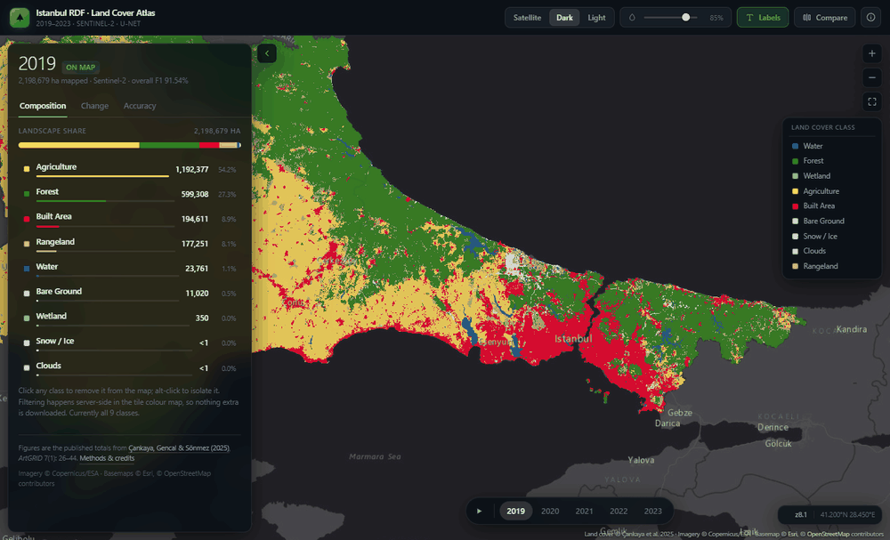

# Istanbul RDF — Land Cover Atlas

Interactive atlas of land use / land cover change across the **Istanbul Regional
Directorate of Forestry (RDF)**, 2019–2023. Five annual maps covering ~2.2 million
hectares, produced by classifying Sentinel-2 summer composites with a **U-Net**
semantic segmentation model.

**Live:** <https://lulc-one.vercel.app>



The figures shown in the application are the published totals from:

> Çankaya, E. Ç., Gencal, B., & Sönmez, T. (2025). *Advancing forest land monitoring in
> Istanbul Regional Directorate of Forestry: integrating U-Net deep learning.*
> Journal of Architecture, Engineering & Fine Arts (ArtGRID), 7(1), 26–44.
> [doi:10.57165/artgrid.1709260](https://doi.org/10.57165/artgrid.1709260) ·
> [PDF](docs/cankaya-2025-istanbul-rdf-lulc.pdf)

---

## What it does

| | |
|---|---|
| **Year timeline** | Step or auto-play through 2019–2023 with crossfaded raster layers |
| **Swipe compare** | Two synchronised maps split by a draggable divider |
| **Class filter** | Toggle or isolate any of the nine classes — the filter is applied server-side in the tiler colour map, so no extra bytes are fetched |
| **Composition** | Landscape share, hectares and percentages per class |
| **Change** | Net change vs. a chosen baseline, diverging bars, and an indexed trajectory chart |
| **Accuracy** | Per-class precision / recall / F1 from Table 1 of the paper |
| **Shareable state** | Year, comparison, basemap, opacity, class filter and camera are encoded in the URL hash |

Keyboard: `←` `→` step years · `1`–`5` jump · `Space` play · `C` compare ·
`P` panel · `B` basemap · `L` labels · `?` about.

---

## Architecture

This is a **static site with no build step**. Open `index.html` behind any HTTP
server and it runs.

```
index.html                   Markup and the full control surface
assets/css/app.css           Design system and layout
assets/js/data.js            Published areas, accuracy table, palette, tile config
assets/js/charts.js          Hand-rolled SVG sparkline and trajectory chart
assets/js/app.js             Map, state, panel rendering, URL sync
assets/vendor/maplibre-gl.*  MapLibre GL JS 5.24 (vendored, not a CDN)
scripts/check-basemaps.mjs   Fails if a basemap needs an API key or stops serving tiles
docs/                        The published article
archive/shiny-app/           The previous R Shiny implementation, kept for reference
```

Two decisions carry most of the performance:

- **No charting library.** Plotly alone was heavier than everything this app ships.
  The sparklines and the trajectory chart are a few dozen lines of SVG that inherit
  the same CSS custom properties as the rest of the interface.
- **No server.** The old version required an R process per visitor; every panel
  redraw was a websocket round-trip. Here the statistics are a 6 KB JavaScript
  object and only map tiles cross the network.

Land cover rasters are served as `{z}/{x}/{y}` PNG tiles with a discrete colour map
built at request time from the visible class set. Class values follow the model
output (1 Water, 2 Forest, 4 Wetland, 5 Agriculture, 7 Built Area, 8 Bare Ground,
9 Snow/Ice, 10 Clouds, 11 Rangeland) and the palette follows the Esri land-cover
convention so the maps read the same way as other published LULC products.
Rasters are capped at zoom 14 — the last zoom that carries real 10 m information —
and overzoomed with nearest-neighbour resampling so class edges stay crisp rather
than being blended into colours that do not exist.

---

## Running locally

```bash
python -m http.server 4173
```

Then open <http://localhost:4173>. ES modules require HTTP; opening the file
directly with `file://` will not work.

## Deploying

The repository is a static site — Vercel needs no framework preset, no build
command, and no output directory. `vercel.json` only sets cache and security
headers.

## Basemaps

All three basemaps (Satellite, Dark, Light) come from Esri's tile service, which
needs no API key. CARTO's basemaps were dropped after they started returning an
"API KEY REQUIRED" watermark with HTTP 200, which the browser cannot detect as an
error. Before adding a provider, run:

```bash
node scripts/check-basemaps.mjs
```

It rejects providers that require a key and checks that every tile URL returns an
image. `.github/workflows/check-basemaps.yml` runs it weekly and on every change
to the basemap config.

---

## Data notes

- Class areas are the published totals, not values recomputed from the tiles, so
  the panel and the article always agree.
- **Rangeland is the weakest class.** It behaves as a transition zone between forest
  and cropland and shares much of their spectral signature; recall never exceeds
  0.59 in any year. Treat year-to-year rangeland swings as the least reliable signal.
- *Clouds* and *Snow/Ice* are residual compositing artefacts covering a negligible
  share of the region. They are retained because the classifier emits them and
  dropping them would misstate the totals.

Headline change, 2019 → 2023: forest −15,251 ha, rangeland −13,226 ha,
agriculture +15,953 ha, built area +13,878 ha.

---

## Credits

Analysis and application by **Ergin Çağatay Çankaya**, with Burhan Gencal and
Turan Sönmez (Bursa Technical University, Faculty of Forestry).

Imagery © Copernicus / ESA. Basemaps © Esri, HERE, Garmin,
© OpenStreetMap contributors. Released under the [MIT licence](LICENSE).
